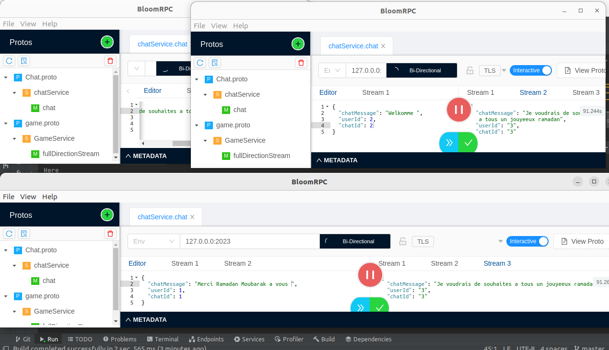

<!DOCTYPE html>
<html lang="en">
<head>
    <meta charset="UTF-8">
</head>
<body>
    <h1>GRPC SERVER CHAT</h1>
    

    <h2>Table of Contents</h2>
    <ul>
        <li><a href="#description">Description</a></li>
        <li><a href="#installation">Test using bloomrpc</a></li>
    </ul>
    

      

        

            <h2 id="description">Test using bloomrpc</h2>
            
This is a brief description of the project.

        

      

    

        

            
        

    

    

    
 
</body>
</html>

